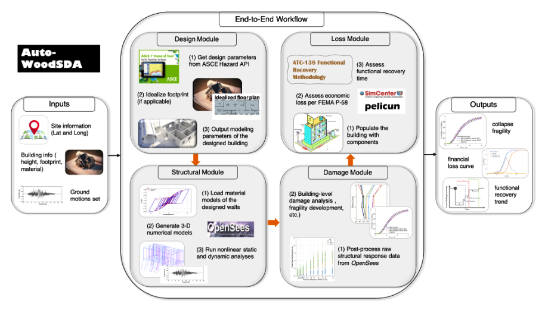

# Auto-WoodSDA 
An end-to-end computational tool to automate seismic design, analysis, and loss assessment of woodframe buildings


## Overview
Auto-WoodSDA (WoodSDA in short) is designed to streamline four major tasks: 1) generate code-compliant seismic design, 2) create numerical models, 3) perform nonlinear analyses, and 4) assess earthquake-induced financial losses and functional recovery time. This tool implements a comprehensive probabilistic framework that integrates code-compliant building design, the FEMA P-58 methodology, and the ATC-138 methodology. Given the set of user inputs, it sequentially executes the four tasks/modules without intermediate human intervention to produce seismic performance metrics such as the expected annual loss or functional recovery time. For an in-depth description, please refer to [this paper](https://doi.org/10.1016/j.jobe.2024.110545).





## Modules

- **Design Module**: Automates the code-compliant seismic design of woodframe buildings.
- **Structural Module**: Generates three-dimensional (3D) OpenSees model(s) and runs nonlinear response history analysis (NRHA).
- **Daamge Module**: Processes raw output files from dynamic analysis, extracts engineering demand parameters (EDPs), and performs building-level damage assessment such as collapse or demolition fragility fitting.
- **Loss Module**: Implements [PELICUN](https://github.com/NHERI-SimCenter/pelicun) to simulate Monte Carlo loss samples per FEMA P-58 methodology. It also implements [beta ATC-138 Methodology](https://github.com/OpenPBEE/PBEE-Recovery) to estimate recovery times.

## Repository Structure

- **BuildingInfo**: Contains information and input files for the buildings to be analyzed.
- **BuildingModels**: Includes ground motion records and OpenSees model files. The set of ground motion records is a user input but WoodSDA generates the OpenSees model file and utilizes the records to run nonlinear response history analysis.
- **Codes**: Houses the scripts for design, structural, damage, and loss modules. It also includes scripts to prepare input files process the outputs and create visualizations.
- **Databases**: Stores static databases which includes Pinching4 parameters and shearwall database among others.
- **Results**: Contains output and results from the analysis.

## Getting Started


### Prerequisites

Ensure you have the following software and libraries installed:
- Python 3.x
- Basic libraries (e.g., Numpy, Pandas, Matplolib, etc)
- OpenSees
- Jupyter Notebook
- MATLAB
- MATLAB API for Python
- Other dependencies (e.g., Pelicun has its own set of dependencies)

### Installation

First, fork this repo. To clone the repository to your local machine:
```bash
git clone https://github.com/<user>/Auto-WoodSDA.git
cd Auto-WoodSDA
```

## Running the Tool

1. **Prepare Building Info**: Populate the building information for the desired building archetypes. An example `.xlsx` file is available in the `BuildingInfo/MFD6B` folder to help create the required input `.txt` files.
2. **Select Ground Motion Records**: Place the selected and processed ground motion records in the `BuildingModels/GM_sets` folder. The `GM_sets/<Name of GM Folder>` should consist of folders named with numbers that represent the strip/hazard level. The naming should always start with 1. Inside each hazard level, there should be two folders `GroundMotionInfo` and `histories.` The format of the files should be consistent with the one shown in the example. 
3. **Execute Workflow**: Run the `woodSDA_driver_E2E.ipynb` Notebook to execute the end-to-end workflow.

### Running on HPC

Use the following script to run jobs on HPC

```bash
qsub submitJob.sh 
```

## Contributions

We welcome contributions from the community. Please fork the repository, make your changes, and submit a pull request.


## Citation

Please cite the following paper:
<pre>
@article{dahal2024autowoodsda,
  title={Auto-WoodSDA: A scalable end-to-end automation tool to perform probabilistic seismic risk and resilience analysis of new residential woodframe buildings},
  author={Dahal, Laxman and Burton, Henry and Yi, Zhengxiang and He, Zizhao},
  journal={Journal of Building Engineering},
  pages={110545},
  year={2024},
  issn={2352-7102},
  doi={https://doi.org/10.1016/j.jobe.2024.110545}
}
</pre>

## License 

This project is licensed under the BSD 4-Clause License - see the LICENSE file for details.

## Contact

For any questions or inquiries, please contact Laxman Dahal at laxman.dahal@ucla.edu
