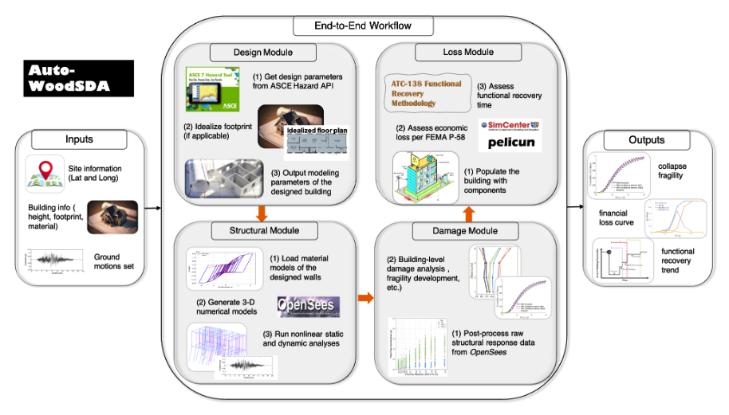

# Auto-WoodSDA 
An end-to-end computational tool to automate seismic design, analysis, and loss assessment of woodframe buildings


## Overview
Auto-WoodSDA (WoodSDA in short) is designed to streamline four major tasks: 1) generate code-compliant seismic design, 2) create numerical models, 3) perform nonlinear analyses, and 4) assess earthquake-induced financial losses and functional recovery time. This tool implements a comprehensive probabilistic framework that integrates code-compliant building design, the FEMA P-58 methodology, and the ATC-138 methodology. Given the set of user inputs, it sequentially executes the four tasks/modules without intermediate human intervention to produce seismic performance metrics such as the expected annual loss or functional recovery time. For an in-depth description, please refer to [this paper](https://doi.org/10.1016/j.jobe.2024.110545).

The entire pipeline is now installable with a single `pip install -r requirements.txt` -- no MATLAB license and no external `OpenSees` binary are required to run it end-to-end (see [What's New](#whats-new)).




## What's New

The pipeline has moved from a Tcl-file-generation + external-binary + MATLAB toolchain to an
in-process, pure-Python one. If you used an earlier version of this repo, the short version is:
**everything below still works the same conceptually, but the recommended path needs only
`pip install -r requirements.txt` now.**

- **OpenSeesPy engine**: `run_designModule.py --engine openseespy` runs eigen, pushover, and
  dynamic (NRHA) analyses in-process via [OpenSeesPy](https://openseespydoc.readthedocs.io/),
  with no external `OpenSees` binary and no MATLAB. The original `--engine tcl` path (writes
  `.tcl` files, needs an `OpenSees` executable on your `PATH`) still works unchanged and is
  still what `submitJob_E2E.sh`'s HPC path uses.
- **Input-authoring GUI**: a local Streamlit app (`Codes/gui/`) edits an archetype's
  `building_config.yaml` -- including a brand-new archetype's wall-line skeleton -- instead of
  hand-editing that file or the old per-archetype `.txt` tree. See
  [Authoring Building Input](#authoring-building-input-gui-or-manual) below.
  The legacy `.txt` input format (`Geometry/`, `Loads/`, etc.) is retired; the archived
  originals for the two example archetypes live under `Archive/BuildingInfo_legacy_txt/` for
  reference.
- **Multiple Stripe Analysis (MSA) orchestration**: `run_msa_cli.py` runs every ground-motion
  pair at every hazard level in parallel (one OS process per worker) and writes the damage
  module's `Results/<id>/EDP_data/` output directly, including an optional collapse-fragility
  fit -- replacing the old per-GM HPC array-job + separate post-processing script combination.
- **Real `pelicun` package**: the loss module calls the actual
  [NHERI-SimCenter/pelicun](https://github.com/NHERI-SimCenter/pelicun) PyPI package directly,
  replacing a 45MB vendored/forked copy that existed only because of an old API limitation.
- **Real `atc138` package**: the functional-recovery module calls OpenPBEE's
  [`atc138`](https://github.com/OpenPBEE/Functional-Recovery-Python) PyPI package -- a native
  Python port of the original MATLAB PBEE-Recovery methodology, published by the same
  authors -- replacing the `matlab.engine`-driven vendored MATLAB tree. **MATLAB is no longer
  a dependency of this tool at all.**
- **A fully end-to-end OpenSeesPy notebook**:
  [`Codes/woodSDA_driver_E2E_openseespy.ipynb`](Codes/woodSDA_driver_E2E_openseespy.ipynb) now
  runs design -> eigen/pushover -> dynamic (NRHA) -> damage (MSA) -> loss (Pelicun + ATC-138)
  in one notebook, in one Python environment. This is the recommended starting point -- see
  [End-to-End Notebooks](#end-to-end-notebooks).

## Modules

- **Design Module** (`Codes/designModule/`, driven by `Codes/run_designModule.py`): Automates the code-compliant seismic design of woodframe buildings -- iteratively sizes each shear wall's assembly to satisfy strength and drift limits and produces the per-wall-line design schedule.
- **Structural Module** (`Codes/structuralModule/`): Generates three-dimensional (3D) building model(s) and runs eigenvalue, pushover, and nonlinear response history analysis (NRHA) -- either in-process via OpenSeesPy (`openseespy_eigen/`, `openseespy_pushover/`, `openseespy_dynamic/`), or by writing `.tcl` files for an external `OpenSees` binary (`--engine tcl`).
- **Damage Module** (`Codes/structuralModule/openseespy_dynamic/msa_orchestrator.py`, `Codes/damageModule/`): Runs Multiple Stripe Analysis (every ground motion at every hazard level, in parallel across CPU cores), extracts engineering demand parameters (EDPs) such as peak story drift and floor acceleration, and performs building-level damage assessment such as collapse or demolition fragility fitting.
- **Loss Module** (`Codes/lossModule/`): Implements [PELICUN](https://github.com/NHERI-SimCenter/pelicun) (`Loss_Pelicun/`, driven by `driverPelicun_E2E.py`) to simulate Monte Carlo loss samples per FEMA P-58 methodology, and the [ATC-138 functional-recovery methodology](https://github.com/OpenPBEE/Functional-Recovery-Python) (`Loss_ATC138/`, driven by `driverATC138_E2E.py`, via OpenPBEE's `atc138` Python package) to estimate reoccupancy and functional recovery times.

Two supporting pieces sit alongside these four: the **input schema** (`Codes/schema/`, a
Pydantic model every module reads and writes `building_config.yaml` through) and
**post-processing** (`Codes/postProcessing/` -- plotting and fragility-curve fitting for
damage/loss output, e.g. `Plot_Results.ipynb`).

## Repository Structure

- **`BuildingInfo/`**: Each archetype's `building_config.yaml` (the validated input schema),
  plus its `BaselineTclFiles/` (used by the `tcl` engine) and `ComponentsList/` (FEMA P-58
  component data for the loss module). Two archetypes ship with real, ready-to-use data:
  `MFD6B` (4-story multi-family) and `s1_48x32` (1-story single-family).
- **`BuildingModels/`**: Ground-motion sets (`GM_sets/<name>/<hazard level>/`) and generated
  model/analysis output -- `<id>/OpenSeesPyResults/` under the `openseespy` engine, or `.tcl`
  files and their outputs under the `tcl` engine.
- **`Codes/`**:
  - `designModule/`, `structuralModule/` (`openseespy_eigen/`, `openseespy_pushover/`,
    `openseespy_dynamic/`), `damageModule/`, `lossModule/` (`Loss_Pelicun/`, `Loss_ATC138/`)
    -- the four modules, see [Modules](#modules).
  - `schema/` -- the `BuildingConfig` Pydantic model and `building_config.yaml` load/save.
  - `gui/` -- the input-authoring Streamlit app, see
    [Authoring Building Input](#authoring-building-input-gui-or-manual).
  - `postProcessing/` -- plotting and fragility-curve fitting for damage/loss output.
  - `run_designModule.py`, `woodSDA_driver_E2E_openseespy.ipynb`,
    `woodSDA_driver_E2E.ipynb` -- the main entry points, see
    [Running the Pipeline](#running-the-pipeline) and
    [End-to-End Notebooks](#end-to-end-notebooks).
- **`Databases/`**: Static reference data -- Pinching4 hysteresis parameters, the shear-wall
  design database, and `Baseline_archetype_info_w_periods.json` (the catalog of known
  grid-plan layout types and their fundamental periods).
- **`Results/`**: Output from the damage and loss modules (`EDP_data/`, `LossAnalysis/`) per
  archetype.
- **`Archive/`**: Retired input formats kept for reference (`BuildingInfo_legacy_txt/` -- the
  pre-schema `.txt` input trees).
- Repo root: `Buildings_input_info.csv` (one row per archetype -- site/seismic parameters),
  `Exhaustive Inputs List.xlsx` (a field-by-field reference for every input), `requirements.txt`.

## Getting Started

### Prerequisites

- Python >= 3.10 (needed for `openseespy` and `streamlit`; avoid the exact patch version 3.9.7, which `streamlit` refuses to install on).
- Everything else installs from `requirements.txt` -- see that file for notes on individual packages (it's the single source of truth for what's needed, and why).
- An external `OpenSees` binary on your `PATH` **only if** you plan to use `--engine tcl`. The default recommended path (`--engine openseespy`) needs no external binary and no MATLAB.
- **MATLAB is not required** for any part of this pipeline anymore.

### Installation

```bash
git clone https://github.com/<user>/Auto-WoodSDA.git
cd Auto-WoodSDA
python -m venv .venv && source .venv/bin/activate   # or conda create -n woodsda python=3.11
pip install -r requirements.txt
```

### Verify Your Install

Two archetypes ship with real, committed input data, so you can confirm your environment
works before authoring anything of your own: `MFD6B` (4-story multi-family) and `s1_48x32`
(1-story single-family, registered as `s1_48x32_Stucco_GWB_Normal_Vs10` in
`Buildings_input_info.csv`). The single-story archetype's design + eigen + pushover finishes
in well under a minute (`MFD6B`'s own pushover takes ~10-15 min/direction -- see
[Running the Pipeline](#running-the-pipeline)):

```bash
python Codes/run_designModule.py --buildingID s1_48x32_Stucco_GWB_Normal_Vs10 --engine openseespy --run-static
```

A successful run prints the code-compliant design confirmation, OpenSeesPy modal periods, and
a pushover base-strength ratio for both directions with no traceback -- if you see that,
your environment is set up correctly and you're ready for [Authoring Building
Input](#authoring-building-input-gui-or-manual) or [Running the
Pipeline](#running-the-pipeline) on your own archetype.

## Authoring Building Input (GUI or manual)

Each archetype is defined by a `BuildingInfo/<archetype>/building_config.yaml` (geometry, loads,
wall-line materials/design constraints, and analysis parameters) plus one row in the repo-root
`Buildings_input_info.csv` (site/seismic parameters: Site Class, R/Cd/Ie, Ss/S1 or Lat/Long,
wall material, seismic weight -- most of these auto-fill with sensible defaults, and Ss/S1 can
be fetched automatically from the USGS hazard API given a Lat/Long).

**Recommended: the input-authoring GUI.** A local Streamlit app -- nothing is hosted or
uploaded, it runs entirely on your machine:

```bash
streamlit run Codes/gui/app.py
```

It has two pages:

- **Archetype Editor** -- edit an existing archetype's full `building_config.yaml`: geometry
  (with a live 2D plan-view and 3D wireframe preview), loads, per-wall-line
  materials/design constraints, and analysis parameters. Every save is validated through the
  same `BuildingConfig` schema (`Codes/schema/building_config.py`) the rest of the pipeline
  uses, so a save that succeeds is guaranteed schema-valid.
- **New Archetype** -- author a brand-new grid-plan layout from scratch. Pick the number of
  grid lines per direction (a slider) and the number of walls per line (independently per
  line); it builds a full, valid archetype with a sensibly-defaulted skeleton (geometry, an
  auto-derived leaning-column grid, and flat placeholder materials/loads/design constraints),
  then automatically registers it in `Buildings_input_info.csv` and
  `Databases/Baseline_archetype_info_w_periods.json` for you. The fundamental period is
  estimated with ASCE 7's low-rise shortcut (`T = 0.1 x NumStories`), not a real eigen
  analysis -- **review and correct every placeholder value in the Archetype Editor, and run a
  real design (`--engine openseespy --run-static`, see below) before trusting any result from
  a freshly-created archetype.**

Known limitations of the GUI (both deliberate, not bugs): an existing archetype's story count
is fixed once loaded (clone/author a new archetype for a different story count); ground-motion
set assembly is **not** handled by the GUI (see below). Full details:
[`Codes/gui/README.md`](Codes/gui/README.md).

**Manual alternative**: hand-edit `building_config.yaml` directly (an example `.xlsx` field
reference, `Exhaustive Inputs List.xlsx`, is at the repo root) and add/edit the matching row in
`Buildings_input_info.csv`. `Codes/designModule/migrate_txt_to_yaml.py` is also available as a
reference if you're porting an old-style `.txt` input tree (see `Archive/BuildingInfo_legacy_txt/`
for what that format looked like).

## Ground Motion Records

Ground motions are a user input, not something the GUI assembles. Place your selected and
scaled records under `BuildingModels/GM_sets/<name>/<hazard level>/`, where `<hazard level>` is
a plain integer folder name starting at `1`. Each hazard-level folder needs a `GroundMotionInfo/`
subfolder (`GMFileNames.txt`, `GMNumPoints.txt`, `GMTimeSteps.txt`, `BiDirectionMCEScaleFactors.txt`)
and a `histories/` subfolder with the raw acceleration records -- see
`Codes/structuralModule/openseespy_dynamic/ground_motion.py`'s module docstring for the exact
file-format contract, and `BuildingModels/GM_sets/BoelterHall/1/` for a real, working example.
The number of hazard levels and ground-motion pairs is derived automatically from this folder
structure -- there's nothing else to configure.

## Running the Pipeline

Once an archetype's `building_config.yaml` and `Buildings_input_info.csv` row exist and its
ground motions are in place, run each module from the repo root (`Codes/` needs to be
importable -- the CLIs below handle their own `sys.path` setup):

**1. Design + eigen/pushover** (one call):

```bash
python Codes/run_designModule.py --buildingID MFD6B --engine openseespy --run-static
```

`--engine openseespy` runs in-process (no external `OpenSees`, no MATLAB); `--engine tcl`
(the default if `--engine` is omitted) writes `.tcl` files for an external `OpenSees` binary
instead. `--run-static` also runs eigen + pushover (default: design only). Add
`--no-run-dynamic` to skip generating the dynamic model/analysis setup if you only want the
design and static results. Results land under `BuildingModels/<id>/OpenSeesPyResults/` (the
`openseespy` engine) or as `.tcl` files (the `tcl` engine).

**2. Dynamic analysis (NRHA)** -- a single ground motion, for a quick check:

```bash
python Codes/structuralModule/openseespy_dynamic/run_dynamic_cli.py \
    --buildingID MFD6B --gmSet BoelterHall --hazardLevel 1 --gmIndex 0 --pairing 1
```

**3. Damage module** -- the full Multiple Stripe Analysis (every GM pair at every hazard
level, in parallel), writing `Results/<id>/EDP_data/`:

```bash
python Codes/structuralModule/openseespy_dynamic/run_msa_cli.py \
    --buildingID MFD6B --gmSet BoelterHall --workers 4 --hazardLevelIM 0.403
```

`--workers` defaults to your CPU count; `--gmLimit` caps how many GM pairs per hazard level
run (useful for a quick smoke test); `--hazardLevelIM` (one Sa value per hazard level,
comma-separated) is optional and only needed if you want a collapse-fragility curve fit
alongside the raw EDP data. **A full MSA can take from minutes to hours depending on the
archetype, GM set size, and available cores** -- there is no shortcut around running every
GM/hazard-level combination.

**4. Loss module** -- Pelicun (FEMA P-58), then ATC-138 (functional recovery), both reading
the EDP data the damage module just produced:

```python
import sys
sys.path.append('Codes/lossModule')

from driverPelicun_E2E import main as run_pelicun
from driverATC138_E2E import main as run_atc138_recovery

run_pelicun(
    buildingID='MFD6B',
    HAZARD_LEVEL=[...],   # Sa value per hazard level -- labels the demand file's IM column
    NUM_GM=[...],         # GM pair count per hazard level (matches EDP_data/)
    num_story=4,
    per_story_area=96 * 48,
    occupancy_type='Multi-Unit Residential',
    collapse_limit=0.1,
)
run_atc138_recovery('MFD6B')  # reads every Results/<id>/LossAnalysis/PelicunOutput/IL_* it finds
```

`run_atc138_recovery` needs no arguments beyond the building ID -- it reads the archetype's
geometry/replacement-cost back from the Pelicun config and `building_config.yaml`, and
automatically discovers however many hazard levels Pelicun produced output for. Output lands
in `Results/<id>/LossAnalysis/{PelicunOutput,ATC138Output}/IL_<n>/`.

## End-to-End Notebooks

Two driver notebooks run the whole pipeline in one place -- prefer the first one:

- **[`Codes/woodSDA_driver_E2E_openseespy.ipynb`](Codes/woodSDA_driver_E2E_openseespy.ipynb)**
  (recommended): design -> eigen/pushover -> dynamic (NRHA) -> damage (MSA) -> loss (Pelicun +
  ATC-138), entirely in-process. Needs only `pip install -r requirements.txt` -- no external
  `OpenSees` binary, no MATLAB. Runs one archetype (`MFD6B` by default) under one Python
  kernel from start to finish; see the notebook's own intro cell for per-section runtime
  expectations (the pushover section is the slow part, ~10-15 min/direction).
- **[`Codes/woodSDA_driver_E2E.ipynb`](Codes/woodSDA_driver_E2E.ipynb)**: the original `tcl`-engine
  path -- needs an external `OpenSees` binary on your `PATH`. Its loss-module cells already use
  the real `pelicun`/`atc138` packages (same as above), only the structural-analysis path
  differs.

`Codes/woodSDA_driver_debug.ipynb` is an older scratch/debugging notebook, kept for reference
but not maintained in lockstep with the pipeline -- prefer the two notebooks above.

### Running on HPC

The HPC batch path still uses the `tcl` engine (its downstream steps read the `.tcl`-generated
model's `.out` recorder-file layout):

```bash
qsub Codes/submitJob_E2E.sh
```

## Contributions

We welcome contributions from the community. Please fork the repository, make your changes, and submit a pull request.


## Citation

Please cite the following paper:
<pre>
@article{dahal2024autowoodsda,
  title={Auto-WoodSDA: A scalable end-to-end automation tool to perform probabilistic seismic risk and resilience analysis of new residential woodframe buildings},
  author={Dahal, Laxman and Burton, Henry and Yi, Zhengxiang and He, Zizhao},
  journal={Journal of Building Engineering},
  pages={110545},
  year={2024},
  issn={2352-7102},
  doi={https://doi.org/10.1016/j.jobe.2024.110545}
}
</pre>

## License 

This project is licensed under the BSD 4-Clause License - see the LICENSE file for details.

## Contact

For any questions or inquiries, please contact Laxman Dahal at laxman.dahal@ucla.edu
